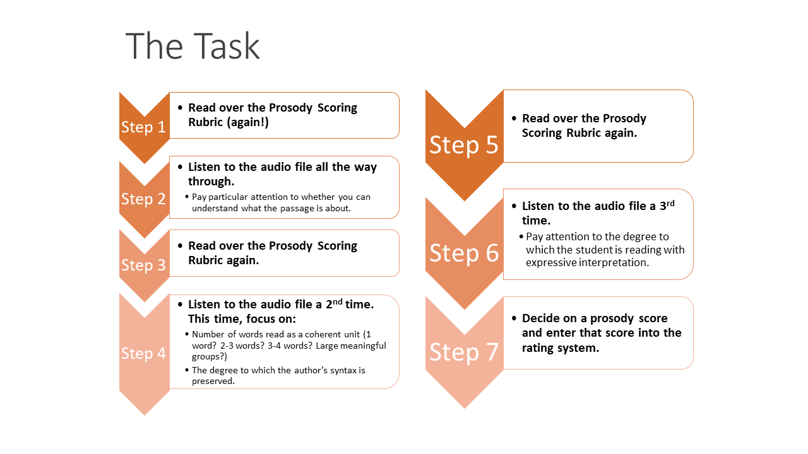

## Welcome to the CORE II Prosody Study! 
Thank you so much for your interest in partnering with us on this important work. We are grateful for all you do on behalf of children.

### The Task
For this project, we have thousands of audio files from students in Grades 2-4, reading very short passages (less than 90 seconds each). We need educators (you!) to listen to these audio files and rate them for prosody – the expressiveness with which the student read the passage. These scores will serve as the basis for our subsequent study to automatically generate prosody scores, which will provide teachers with important information about their students’ reading. All of the audio files were collected in a previous research study.

### Training Materials
Here you will find the materials for the two training sessions, where we teach you everything you need for this project. 

* [The Prosody Rubric](https://jnese.github.io/CORE-II_trainingwebsite/prosody_rubric.html)
* The [slides and recordings](https://jnese.github.io/CORE-II_trainingwebsite/training_materials.html) from the training sessions
* [Exemplar audio files](https://jnese.github.io/CORE-II_trainingwebsite/exemplar_audiofiles.html) so you can listen to readings that have been scored by or research team to calibrate your own ratings
* For assistance please email <jnese@uoregon.edu>

